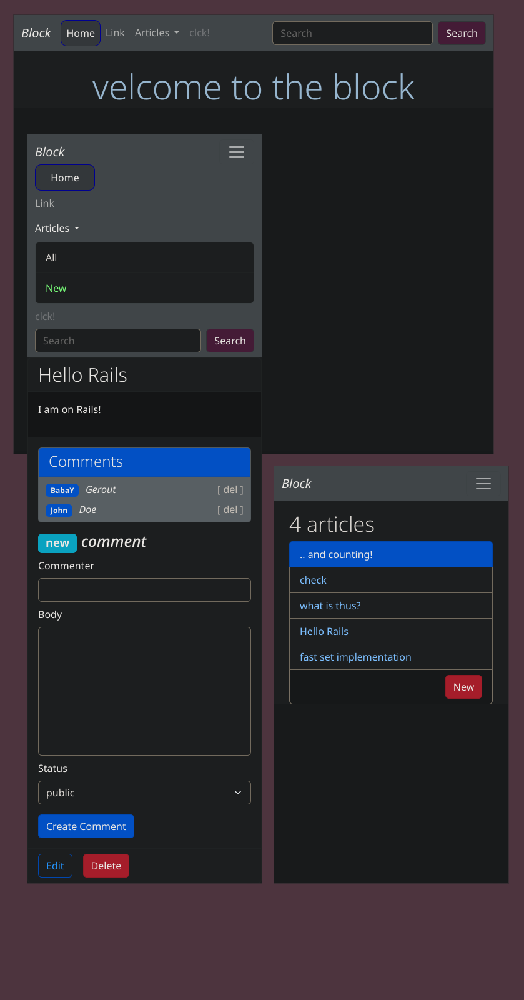

# block
Yea, Im finished with my fyorst *Rails* app, its a simple *blog*,
where you can post new *Articles*, edit and delete them, post new *Comments*,
on a given article and delete them. It also has enabled a *Search* functionality
by looking for keys in article titles, basically thats' it:)

Ive made a ***docker*** image, if you want to see it in action:), so type
```bash
$ docker pull neznajko/block
``` 
to pull the image and then run the container with:
```bash
$ docker container run --name block -p 3000:3000 neznajko/block
```
Now open a browser( tested on Chrome only ) in incognito mode( optional ) at
localhost:3000

Finally clean with:
```bash
$ docker container rm -f block
$ docker image rm neznajko/block
```

